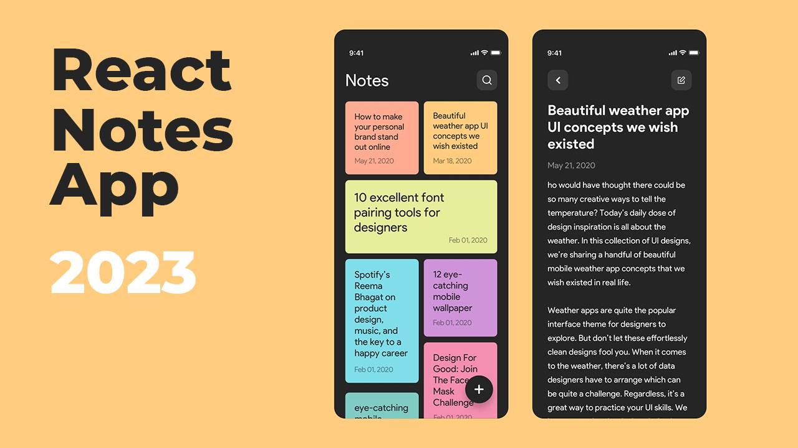

# React Note App README

Welcome to the React Note App! This application allows you to manage your notes with ease. You can create, update, delete, search, and save notes using your browser's local storage.



## Features

1. **Create Note:** You can easily create a new note by clicking on the "Create" button. A new note will be added to the list.

2. **Update Note:** To update a note, click on the note you want to edit. This will open the note in edit mode, allowing you to make changes. After editing, you can save your changes by clicking the "Save" button.

3. **Delete Note:** If you want to delete a note, simply click the "Delete" button next to the note you wish to remove. A confirmation prompt will ensure you don't accidentally delete a note.

4. **Search Note:** You can search for specific notes by using the search bar at the top. As you type, the app will dynamically filter the notes to display only those containing your search query.

5. **Save to Local Storage:** All your notes are automatically saved to your browser's local storage. This means you can close the app and come back later to find your notes exactly as you left them.

## Getting Started

To run the React Note App locally on your machine, follow these steps:

1. **Clone the Repository:** Start by cloning this repository to your local machine using the following command:

   ```
   git clone https://github.com/mahmoud-pro/react-note-app.git
   ```

2. **Navigate to the Directory:** Move into the project directory:

   ```
   cd react-note-app
   ```

3. **Install Dependencies:** Use npm or yarn to install the required dependencies:

   ```
   npm install
   ```

   or

   ```
   yarn install
   ```

4. **Run the App:** Once the dependencies are installed, you can start the development server:

   ```
   npm start
   ```

   or

   ```
   yarn start
   ```

5. **Access the App:** Open your web browser and go to `http://localhost:3000` to access the React Note App.

## Technologies Used

- React: A JavaScript library for building user interfaces.
- HTML & CSS: For structuring and styling the app.
- Local Storage: For storing notes locally within the browser.

## Contributing

If you'd like to contribute to this project, feel free to submit pull requests or issues to the [GitHub repository](https://github.com/mahmoud-pro/react-note-app). We welcome contributions from the community!

We hope you enjoy using the React Note App for managing your notes efficiently! If you have any questions or need assistance, please don't hesitate to reach out to us.

Happy noting! 📝
